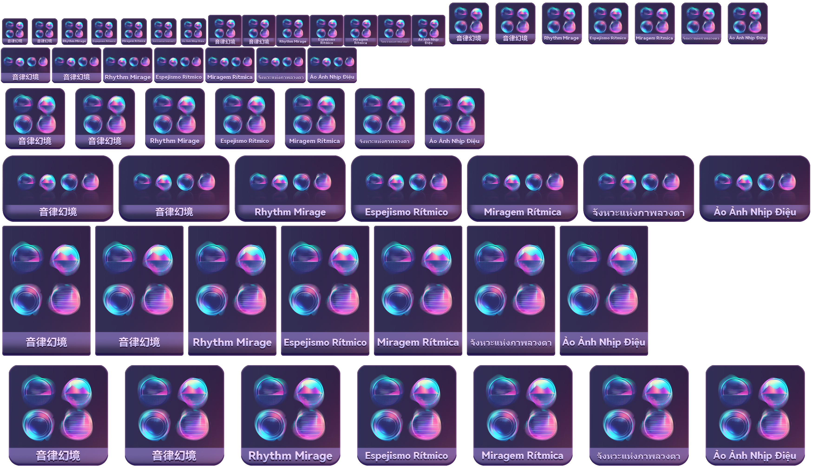

# RapidIconGen

[中文版本](README.zh.md)

**RapidIconGen** is a tool designed for mass production scenarios that enables one-click generation of multi-size, multi-language icons. After configuration, the tool automates icon generation and creates a preview image for easy review of the final results.

## Features

- Supports batch generation of multi-size, multi-language icons.
- Selectively applies masks based on CSV data.
- Automatically generates a preview image after creating icons.
- Manages language, size, and text frame configurations through `\modules\config_loader.py`.

## Prerequisites

- Python 3.x
- Required Python libraries:
  - `PIL` (Pillow)
  - `os`
  - `csv`

## Usage

1. **Clone the repository**

   ```bash
   git clone <repository-url>
   ```

2. **Install Pillow**

   Since this project uses `Pillow` for image processing, please install the Python library using the following command:

   ```bash
   pip install Pillow
   ```

3. **Prepare the data**

   Place all image resources, `text_data.csv`, project numbers, and the mask configuration file `prefix_mask_data.csv` in the corresponding asset directories, ensuring the file structure matches the project requirements.

4. **Run the script**

   The script will prompt you to select a folder containing the assets and CSV files. Once processing is complete, it will generate the icons and a preview image.

   ```bash
   python main.py
   ```
   
## Project Resources

The project includes two resource folders, "RhythmMirage" and "RhythmMirage_B," for testing and viewing the necessary data structure.

Here is the translation:


==**Notice**==
The test folder included in this project contains font files. These font files are provided for testing purposes only and are not created or owned by this project. Please do not use these font files for commercial purposes or any other non-testing purposes. For official use, please refer to the original licensing terms of the fonts.

## Output

- Two folders will be generated: `nas_data_list"_"ENU_text` and `dataset_name_layers`.
- Icons of various sizes will be saved in the `"nas_data_list"_"ENU_text"/ICON/PNG` directory within the selected folder.
- The layers used during the drawing process will be retained in `dataset_name_layers`.
- A preview image (`"dataset_name"_Preview.png`) will also be saved for quickly viewing the generated icons.

## Preview

Here’s the preview of the generated icons:



## License

This project is licensed under the MIT License. See the [LICENSE](LICENSE) file for details.